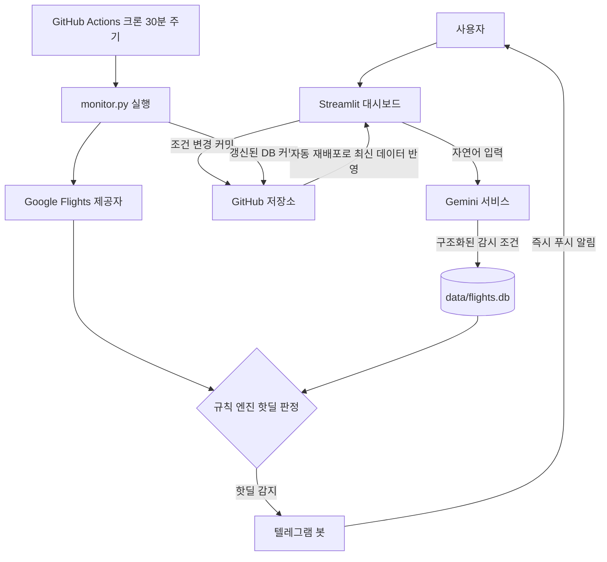

# ✈️ 항공권 핫딜 트래커 (Airplane Tracer)

원하는 노선·날짜를 등록하면 **Google Flights 최저가를 24시간 자동 감시**하고,
가격이 쌓이면(핫딜) **텔레그램으로 즉시 알림**을 보내는 개인용 모니터링 서비스입니다.

- 🤖 **Gemini API**: "다음 달 말 도쿄 3박 4일, 45만원 이하면 알려줘" 같은 자연어를
  감시 조건으로 변환하고, 알림 시 가격 추세 분석까지 첨부
- 🔍 **Google Flights** (`fast-flights`): API 키 없이 실제 노출 최저가 조회
- ⏰ **GitHub Actions 크론**: 30분마다 무료로 24시간 감시 (서버 불필요)
- 🖥️ **Streamlit 대시보드**: 조건 관리 · 가격 추이 차트 · 알림 기록
- 💾 **저장소 커밋 DB**: Streamlit Cloud의 휘발성 디스크 문제를 GitHub 저장소로 해결

## 아키텍처



## 핫딜 판정 규칙

조건마다 아래 3가지 규칙을 조합하고, **쿨다운**(기본 6시간)으로 스팸을 막습니다.

| 규칙 | 기본값 | 설명 |
|---|---|---|
| 🎯 목표가 도달 | 직접 설정 | 목표가 이하로 떨어지면 즉시 알림 |
| 📉 하락률 | 첫 관측가 대비 15% | 등록 후 가격이 이만큼 내려가면 알림 |
| 📊 백분위 | 최근 30일 하위 10% | 관측 10회 이상 쌓인 뒤 역대 저가권 진입 시 알림 |

## 프로젝트 구조

```
airplane tracer/
├── .github/workflows/monitor.yml   # 30분 크론 감시 워크플로우
├── app/
│   ├── config.py                   # .env + st.secrets 이중 로딩
│   ├── database.py                 # SQLite 레이어 (조건/이력/알림 로그)
│   ├── models.py                   # Pydantic 모델
│   ├── github_sync.py              # 대시보드→GitHub DB 커밋 동기화
│   ├── providers/
│   │   ├── base.py                 # 제공자 추상 인터페이스
│   │   └── google_flights.py       # fast-flights 검색 + 재시도
│   └── services/
│       ├── gemini_service.py       # 자연어 파싱 + 딜 분석
│       ├── rule_engine.py          # 핫딜 판정 규칙
│       ├── notifier.py             # 텔레그램 전송
│       └── checker.py              # 감시 사이클 공용 로직
├── streamlit_app/
│   ├── app.py                      # 콘솔 진입점 (대시보드)
│   ├── shared.py                   # 디자인 시스템 · 공용 UI 헬퍼
│   └── pages/                      # 항공편 조회 · 조건 등록 · 가격 추이 ·
│                                   # 감시 조건 · 알림 기록 · 설정
├── monitor.py                      # 헤드리스 감시 실행기
├── data/flights.db                 # 저장소에 커밋되는 데이터베이스
├── requirements.txt
├── .env.example                    # 로컬 개발용 시크릿 템플릿
└── .streamlit/secrets.toml.example # 클라우드 배포용 시크릿 템플릿
```

---

# 🚀 시작하기

## 1) 준비물 발급 (모두 무료)

| 항목 | 발급 방법 |
|---|---|
| Gemini API 키 | https://aistudio.google.com/apikey 에서 생성 |
| Telegram 봇 토큰 | 텔레그램에서 `@BotFather` → `/newbot` → 토큰 복사 |
| Telegram chat ID | 만든 봇에게 아무 메시지 보낸 뒤 `https://api.telegram.org/bot<토큰>/getUpdates` 접속 → `chat.id` 값 |
| GitHub PAT | GitHub → Settings → Developer settings → Personal access tokens (classic) → `repo` 권한으로 생성 |

## 2) 로컬 실행

```bash
cd "airplane tracer"
python -m venv .venv
.venv\Scripts\activate        # Windows
pip install -r requirements.txt

copy .env.example .env        # .env 파일에 발급받은 키들을 채워넣기

# 대시보드 실행
streamlit run streamlit_app/app.py

# 수동 감시 사이클 1회 실행 (테스트)
python monitor.py
```

## 3) Streamlit Cloud + GitHub Actions 배포 (24시간 감시)

### 3-1. GitHub 저장소 업로드

```bash
git init
git add .
git commit -m "init: 항공권 핫딜 트래커"
git branch -M main
git remote add origin https://github.com/<내계정>/<저장소명>.git
git push -u origin main
```

> ⚠️ `.gitignore` 덕분에 `.env`와 `.streamlit/secrets.toml`은 커밋되지 않습니다.
> 반면 `data/flights.db`는 **의도적으로 커밋 대상**입니다 (가격 이력 보존용).

### 3-2. GitHub Secrets 등록

저장소 → Settings → Secrets and variables → Actions → New repository secret:

| Name | 값 |
|---|---|
| `GEMINI_API_KEY` | Gemini API 키 |
| `TELEGRAM_BOT_TOKEN` | 봇 토큰 |
| `TELEGRAM_CHAT_ID` | chat ID |

### 3-3. Actions 활성화 확인

저장소 → **Actions** 탭 → *flight-monitor* 워크플로우 → **Enable workflows** 클릭
(필요 시 **Run workflow** 버튼으로 즉시 테스트 실행 가능)

### 3-4. Streamlit Cloud 배포

1. https://share.streamlit.io 접속 → **New app**
2. 저장소 선택 → Branch: `main` → **Main file path: `streamlit_app/app.py`** ← 중요!
3. Deploy
4. 앱 설정(⋮) → **Secrets** 에 `.streamlit/secrets.toml.example` 내용을 복사해 붙여넣고
   실제 키 값으로 채우기 (`GITHUB_TOKEN`/`GITHUB_REPO`, 그리고 공개 URL이므로
   접근 비밀번호 `APP_PASSWORD`도 반드시 설정)

이제:
- 대시보드에서 조건 추가/수정 → GitHub에 자동 커밋 → 다음 크론부터 적용
- 크론이 가격 확인 → DB 갱신 커밋 → Streamlit Cloud 자동 재배포로 차트 최신화
- 핫딜 감지 → 텔레그램 푸시 🎉

## 사용 예시

콘솔 상단 헤더의 **조건 등록** 탭에 이렇게 쓰고 Gemini 분석 버튼만 누르면 됩니다.

```
다음 달 말 도쿄 3박 4일 왕복, 45만원 이하면 알려줘
```
```
12월 24일 출발 방콕 일주일 편도 30만원
```
```
김포 제주 왕복 이번 주말, 8만원 이하
```

---

# 🔧 문제 해결

| 증상 | 원인/해결 |
|---|---|
| 조회 결과 없음 / 실패 로그 | Google이 클라우드 IP를 일시 차단한 경우. 재시도 로직이 처리하며, 지속되면 크론 주기를 늘리세요 (`monitor.yml`의 cron 수정) |
| 알림이 안 옴 | 텔레그램 봇과 **먼저 대화를 시작**했는지 확인 (봇은 먼저 말할 수 없음). getUpdates로 chat ID 재확인 |
| Actions가 안 돌아감 | 공개 저장소는 60일 무활동 시 스케줄 자동 정지 → Actions 탭에서 재활성화 |
| 대시보드 변경이 크론에 반영 안 됨 | Settings 탭에서 GitHub 동기화 상태 확인 (PAT 권한 `repo` 필요) |
| 가격 단위가 이상함 | 통화는 조건별로 저장됩니다. 등록 시 통화를 정확히 선택하세요 |

# ⚠️ 면책

`fast-flights`는 Google Flights의 비공식 내부 엔드포인트를 사용합니다.
개인적 용도로만 사용하세요. 응답 형식이 바뀌면 라이브러리 업데이트가 필요할 수 있습니다
(`pip install -U fast-flights`).
